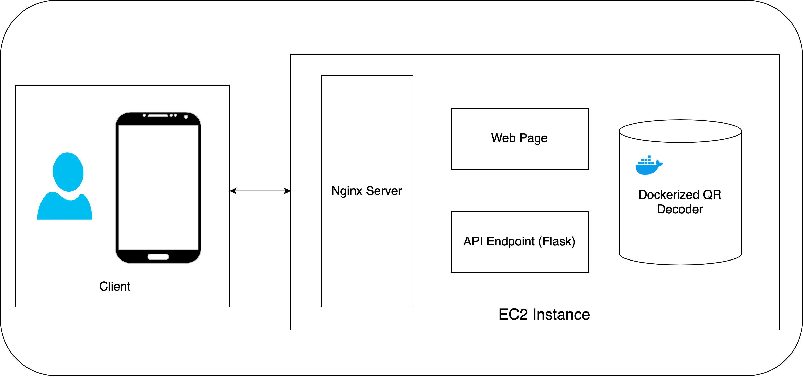
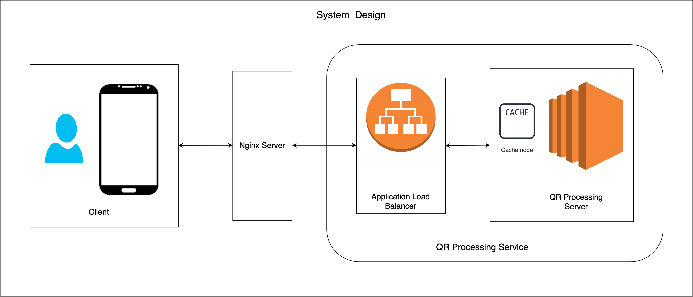

# How to run?:

## Running on local -

`pip3 install requirements.txt`  
`python3 app.py`

## Directly opening the deployed server:

<a href="http://13.233.166.39">13.233.166.39</a>

## Running through Query End Point:

`curl -F "file=@<filename>" http://13.233.166.39`

# Directory Structure

**QR_Scanner**  
├── **app.py**  
├── **templates/index.html**  
├── **Dockerfile**  
├── **images/**  
├── **requirements.txt**  

# Deployment:
The flask application in dockerized and then the docker image is pushed to AWS Elastic Container Registry. 
This docker image is then pulled to an AWS EC2 instance where it is run behind a Nginx reverse-proxy server. 

# System Design for over 1 Million Requests per day:

## Scaling:

Incase of 1 million requests per day I have two approaches in mind - 

1. Horizontal Scaling of EC2 servers - Using docker swarm as the load balancer and using Nginx as the reverse proxy. The deployment method that I have implemented follows this line of thought in case scaling is needed. This approach is also cloud agnostic as the docker containers can run on any cloud infrastructure.

2. Using AWS Lambda as a serverless architecture - We can deploy the QR Decoding application as a serverless function.

#### Note - The QR image provided with the problem statement was incomplete/broken due to which readily available QR Decoding packages were not able to decode it. I have implemented this assignment under the assumption that it was to judge my system designing and application deployment capability. I have added a couple of QR images in the repository with which this application works for testing purposes.  
